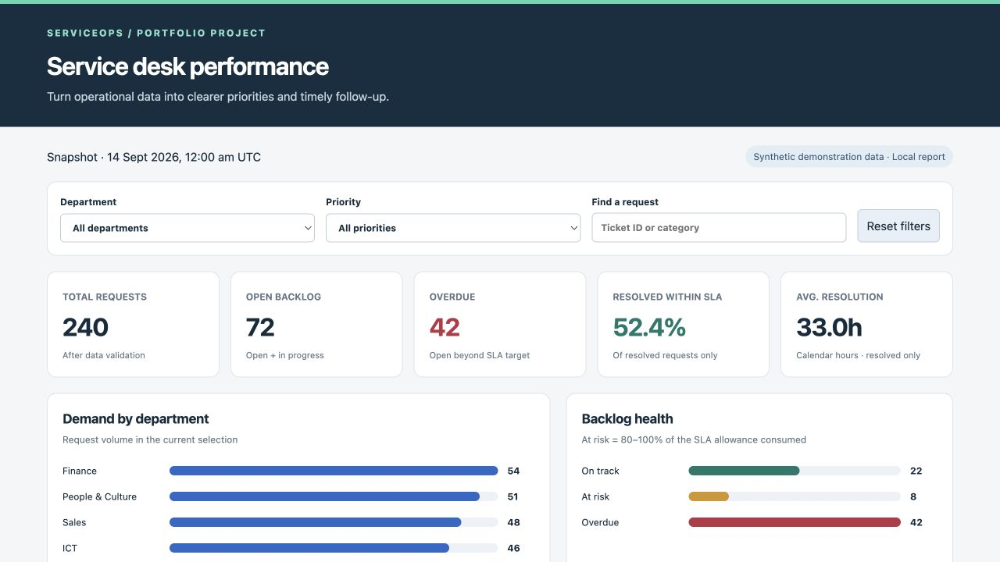

# ServiceOps Insights



A small portfolio project that turns fictional IT service requests into an operational dashboard and structured escalation alerts.

**Business question:** Which requests need attention, which departments generate demand, and how consistently are resolved requests meeting their service target?

Built with Python and SQL, with a local interactive HTML report, Power BI query/measure assets and a Power Automate workflow specification. This project demonstrates business intelligence, data validation, KPI reporting and process automation. It is independent of any employer; all sample records are synthetic.

## Try it in two minutes

Requires Python 3.11 or later. No third-party Python packages, API keys or cloud account are needed for the local demo.

```bash
python3 -m serviceops.pipeline
python3 -m unittest discover -s tests -v
```

On Windows, use `py` in place of `python3`. Run commands from this repository's root folder.

Open **build/dashboard.html** in your browser. It is self-contained and works offline; no web server is required. Filter by department/priority, search a ticket ID or category, and use Reset filters. This repository also includes a prebuilt copy in `examples/dashboard.html`.

## What is implemented

| Component | Status |
| --- | --- |
| Synthetic dataset: 243 input rows | Included; 240 valid + 3 intentional rejects |
| Python validation and SLA classification | Implemented and tested |
| SQL KPI aggregation | Implemented with SQLite in memory |
| Filterable local dashboard | Implemented; browser checked |
| JSON escalation payload | Generated locally; no messages sent |
| Power Query M and DAX measure files | Authored; import and validation in Power BI Desktop still required |
| Power Automate JSON schema and flow specification | Authored; build and testing in your Microsoft tenant still required |
| Automated tests | 15 tests passed locally with Python 3.12 |
| GitHub Actions configuration | Included; latest run passed after the complete source was uploaded |

This is not a production system, a PBIX export, or an importable Power Automate package. Power BI Desktop needs Windows. The existing browser dashboard is a local report and is not presented as a Microsoft Power BI screenshot.

## Data flow

```text
Synthetic CSV
    |
    v
Validation + UTC normalisation ----> rejected_rows.csv
    |
    v
SLA classification + SQL aggregation
    |                      |                         |
    v                      v                         v
tickets_clean.csv     summary.json               alerts.json
    |                      |                         |
    +---- local HTML ------+                         |
    |                                                |
    v                                                v
Power BI import assets                        Power Automate blueprint
(Microsoft setup required)                    (Microsoft setup required)
```

## Outputs and sample results

Generated files go to `build/` and can be recreated by running the pipeline. Tracked examples use the fixed snapshot `2026-09-14T00:00:00Z`.

| Metric | Demo result |
| --- | ---: |
| Valid requests | 240 |
| Rejected rows | 3 |
| Open / in-progress backlog | 72 |
| Resolved requests | 168 |
| Overdue open requests | 42 |
| At-risk open requests | 8 |
| Resolved within SLA | 88 |
| SLA compliance, resolved only | 52.4% |
| Mean resolution time, resolved only | 32.99 hours |

These are measured counts from a synthetic dataset, not real business outcomes. No time-saving or accuracy improvement percentage is claimed.

Files:

- `build/dashboard.html`: self-contained, filterable visual report.
- `build/tickets_clean.csv`: one accepted request per row, with derived SLA fields.
- `build/rejected_rows.csv`: source row, ticket ID and rejection reason.
- `build/summary.json`: SQL totals and grouped reporting data.
- `build/alerts.json`: schema-versioned batch of actionable open requests, with stable snapshot ID.

## Business rules

SLA targets are **calendar hours**, including weekends: Critical = 4, High = 8, Medium = 24, Low = 72. These are illustrative targets, not FUJIFILM policies. The timer starts at creation; this demo does not pause it when waiting on a requester.

- For open requests, elapsed time ends at the reporting snapshot.
- For resolved requests, elapsed time ends at resolution.
- Resolved at or before the SLA deadline: **Met**. Resolved after it: **Breached**.
- Open and beyond deadline: **Overdue**. Open with 80–100% consumed: **At risk**. Otherwise: **On track**.
- Compliance = resolved requests that met SLA / all resolved requests. Open requests are excluded from this denominator.
- Average resolution time ignores open requests. An empty denominator is undefined, displayed as a dash, rather than a misleading 0%.
- Input timestamps must contain a timezone and are normalised to UTC.
- Duplicate IDs retain the first valid row. Invalid dates, statuses, priority values and inconsistent resolution timestamps are quarantined.

The snapshot is explicit to make results reproducible. To change it:

```bash
python3 -m serviceops.pipeline --as-of 2026-09-15T00:00:00Z
```

The demo status field is a snapshot, not a full event history. Do not use a snapshot earlier than the source extract to claim historically correct backlog; rows with future events are rejected. This project models resolution targets, not first-response SLA.

## Microsoft setup

- [Power BI build guide](powerbi/README.md): Power Query import, 10 DAX measures, report layout and reconciliation checks.
- [Power Automate build guide](powerautomate/README.md): manually triggered parsing/filtering/table/email flow, empty-payload checks and optional scheduling considerations.
- [Interview and demo guide](docs/INTERVIEW_GUIDE.md): explain the decisions and demonstrate a change.

## Repository map

```text
serviceops/       Validation, SQL integration and dashboard template
data/            Reproducible fictional input CSV
scripts/         Demo data generator
sql/             SQL reporting queries
tests/           Unit and integration tests
powerbi/         M query, DAX measures, theme and build guide
powerautomate/    Payload schema, build specification and test guide
examples/        Generated sample outputs for a quick review
docs/            Interview preparation and verification notes
.github/         CI workflow
```

Regenerate the source fixture with `python3 scripts/generate_demo.py`. It uses a fixed random seed so it is repeatable. Then rerun the pipeline and tests.

## Limitations and next steps

This is a learning prototype prepared with AI assistance. Run it, inspect the tests and adapt the business rules before discussing it as your portfolio work. Future extensions include real service-desk ingestion, business-calendar SLA timers, event history, persistent alert deduplication and a tested Microsoft cloud deployment. The project does not currently use an LLM; deterministic rules make SLA results explainable.

## Publication verification — 25 September 2026

All 15 tests and report generation passed on Python 3.13. Browser department filtering was checked. Database connections are explicitly closed after aggregation.

See [two-minute demo walkthrough](docs/DEMO.md).
